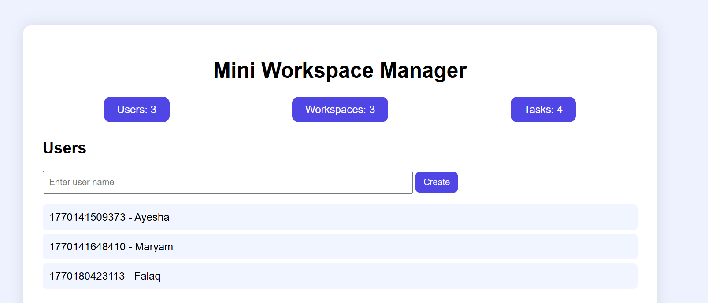
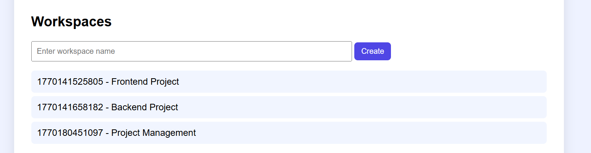
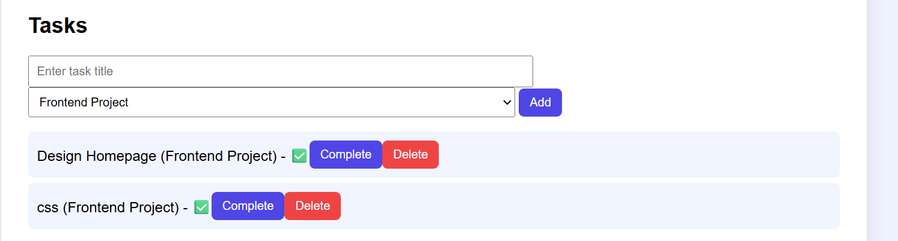
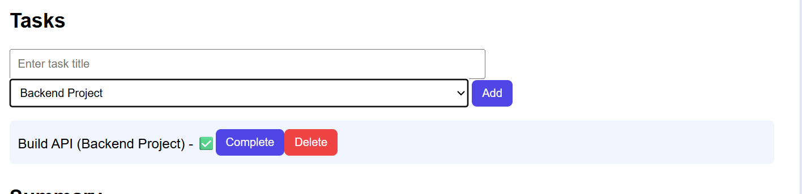
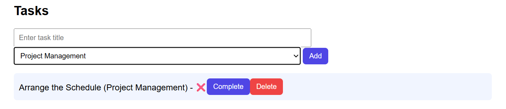
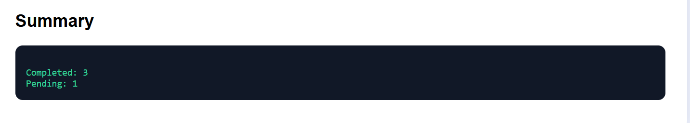

# Mini Workspace App

## Track Chosen
[Full Stack product Engineer]

##  Tech Stack Used
* **Frontend:** HTML, CSS, JavaScript
* **Backend:** Node.js, Express
* **Database:** JSON (data.json)

## Setup and Run Instructions

### 1. Clone the repository
git clone https://github.com/axm19/mini-workspace-app.git
cd "mini-workplace-app"

### 2. Start the Backend Server
cd backend
npm init -y
npm install express cors
node server.js

### 3. Run the Frontend
Open `frontend/index.html` in your preferred browser.

## Screenshots
 
 
 
 
 
 

